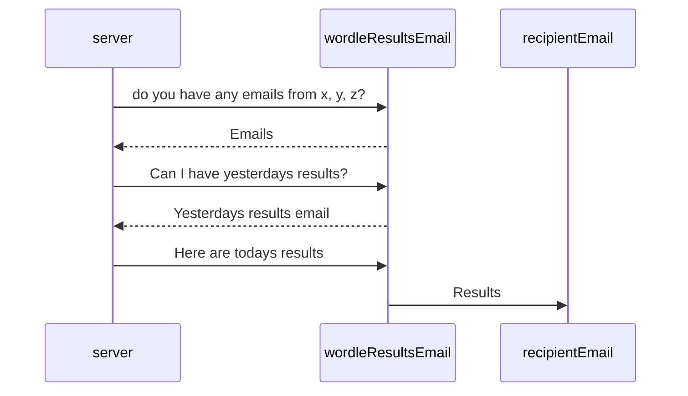

# wordle-leaderboard
A python web app to keep track of scores on the New York Times "Wordle" game. 

## Run the app
`python -m wordle_leaderboard`

```mermaid
sequenceDiagram
  participant server
  participant wordleResultsEmail
  participant recipientEmail
  server->>wordleResultsEmail: do you have any emails from x, y, z?
  wordleResultsEmail-->>server: Emails
  server->>wordleResultsEmail: Can I have yesterdays results?
  wordleResultsEmail-->>server: Yesterdays results email
  server->>wordleResultsEmail: Here are todays results
  wordleResultsEmail->>recipientEmail: Results
```
